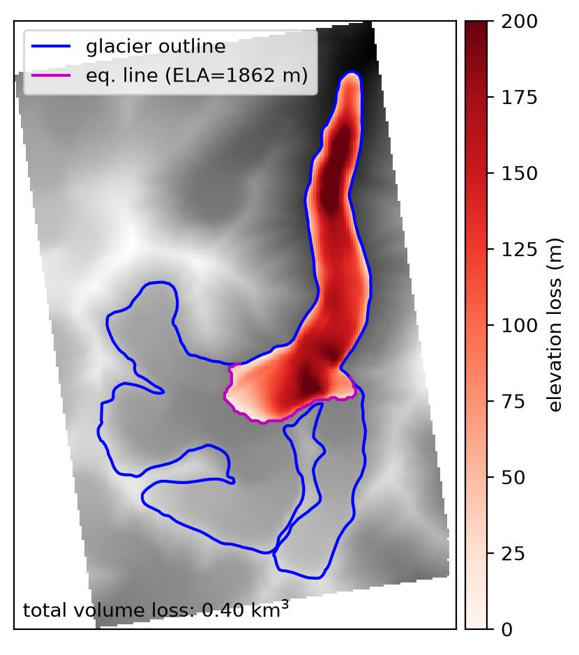
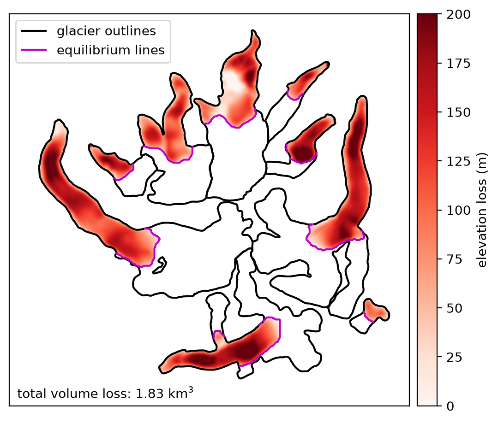

# paleoglac: a python package for paleoglacier reconstruction

## installing

After cloning the repository, navigate to the parent folder of the repository and run the following:

```bash
pip install glacmaptools
```

Alternatively, install a 'development' version:

```bash
pip install -e glacmaptools
```

You can also use `conda` to create a new environment with the necessary dependencies,
using the provided `environment.yml` file.

## PaleoGlac

The primary uses/applications for the `PaleoGlac` class are to calculate the (former) ELA of a glacier, to
reconstruct the former surface of that glacier, and to calculate the corresponding elevation/volume change of that
glacier.

The `PaleoGlac` class is built on [geoutils.Raster](https://geoutils.readthedocs.io/en/stable/raster_class.html). The
main attribute, `.data`, represents the surface elevation from an initial DEM. A `PaleoGlac` has the following
additional properties after initialization:

- `glacier_outline`, the boundary of the (former) glacier
- `glacier_mask`, a binary mask of glacier/not glacier pixels

The geometry of the `glacier_outline` is supplied at initialization:

```python
pglac = PaleoGlac(dem_file_or_dataset, glac)
```

If `crs` is not specified, the output geometry will be the same as the `glacier_outline` supplied. The `glacier_mask`
is a raster representation of the `glacier_outline`, using the same extent and resolution as the object itself.

Once the `PaleoGlac` is initialized, the ELA, `.ela`, should be set. This can be done by supplying an ELA value:

```python
pglac.ela = ela_value
```

Or it can be done using `PaleoGlac.get_ela()`:

```python
pglac.ela(set_val=True, method='aabr', br_val=1.56)
```

The example above sets the `.ela` value in place by calculating it using the AABR method (e.g., 
[Osmaston, 2005](https://doi.org/10.1016/j.quaint.2005.02.004)) with a BR value of 1.56. For additional details about
the different methods currently implemented, see `PaleoGlac.ela` and the corresponding `paleoglac.ela.{method}_ela`.

Once the ELA has been set, the following attributes are also set/availble:

- `ablation_area`, a vector representation of the on-glacier area below the calculated ELA
- `ablation_area_mask`, a raster mask of the ablation area, similar to `glacier_mask`
- `equilibrium_line`, a vector representation of the equilibrium line
- `aar`, the Accumulation Area Ratio, or the proportion of the total glacier area found above the ELA (i.e., in the
  accumulation area).

With the ELA set, the past glacier surface can be reconstructed using `PaleoGlac.reconstruct_surface()`:

```python
pglac.reconstruct_surf(set_val=True)
```

At present, there is only one method implemented (the 'carrivick' method; e.g., 
[Carrivick et al., 2023](https://doi.org/10.1029/2023GL103950)). If `set_val=True`, this sets the `paleo_surface`
property, rather than returning a value.

Once the surface has been reconstructed, the final three properties are available:

- `elev_change`: the per-pixel elevation difference between the current and reconstructed surface
- `volume_change`: the total volume change, sum(elev_change * pixel_area), between the current and reconstructed surface
- `mean_thick_change`: the average elevation change between the current and reconstructed surface

To help illustrate this, there are two scripts in the `examples/` folder, `basic_use.py` and `regional_use.py`. These
scripts demonstrate how this reconstruction works for a single glacier, and for a collection of glaciers, using the
sample data files found in `sample_data/`.


## individual example



## regional example




## future plans

As noted above, at present there is only a single surface reconstruction method implemented. Future plans, if I
manage to stay on top of things, are to work to incorporate workflows from [OGGM](https://oggm.org/) to include
additional methods of surface reconstruction and centerline calculation.

The current implementation of the surface reconstruction works well for small-ish glaciers, but can be quite slow
if working on a large region with many large (> 1000 km²) glaciers. Some future work will also work on downsampling
larger glaciers for the natural neighbor interpolation, before re-sampling to the original geometry.

Stay tuned!